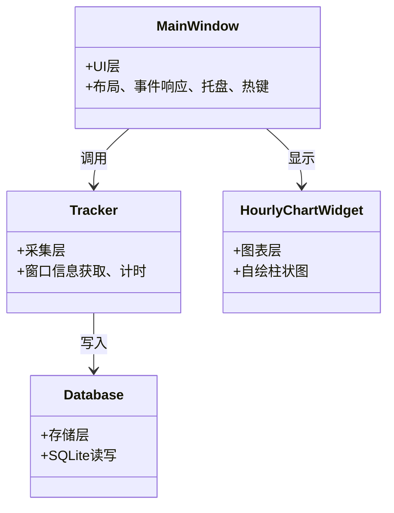

# 高级语言程序设计实验报告

**南开大学 计算机大类**  
姓名：张家辉  
学号：2512793  
班级：模拟二班  
2026年5月13日

## 目录

- [一. 作业题目](#一-作业题目)
- [二. 开发软件](#二-开发软件)
- [三. 课题要求](#三-课题要求)
- [四. 主要流程](#四-主要流程)
  - [1. 整体流程](#1-整体流程)
  - [2. 算法或公式](#2-算法或公式)
  - [3. 单元测试](#3-单元测试)
- [五. 单元测试](#五-单元测试)
- [六. 收获](#六-收获)
  - [1. 面向对象设计与 Qt 框架](#1-面向对象设计与-qt-框架)
  - [2. Windows API 与系统交互](#2-windows-api-与系统交互)
  - [3. AI 工具使用披露](#3-ai-工具使用披露)

---

## 一. 作业题目

设计并实现一个 Windows 桌面应用程序 **TimeTracker**，用于自动记录用户在不同应用程序窗口上的使用时间，并提供每日及每周的可视化统计图表。程序要求在后台静默运行，支持系统托盘最小化、全局热键隐私保护、开机自启动等功能。

## 二. 开发软件

Qt Creator 18.0.2 (Enterprise)

## 三. 课题要求

1. **面向对象**：核心功能模块化，各类职责清晰，低耦合高内聚。  
2. **数据持久化**：使用 SQLite 存储使用记录，支持按日期查询和统计。  
3. **图形绘制**：通过 QPainter 自绘柱状图，不依赖第三方图表库。  
4. **系统集成**：注册全局热键实现隐私隐藏，系统托盘图标后台运行，开机自启动选项。  
5. **单元测试**：对关键算法（数据聚合、时长累加、窗口切换）进行手动测试和验证。

## 四. 主要流程

### 1. 整体流程

程序启动后，初始化数据库和追踪器。Tracker 每 5 秒通过 Windows API 获取当前前台窗口的进程路径、窗口标题，并与上一次记录的窗口比较：

- 若窗口未变，则累加时长。  
- 若窗口切换，则将上一窗口的累计时长写入数据库。  
- 每 30 秒强制刷写，避免数据在内存中丢失。

主界面 (`MainWindow`) 顶部工具栏包含“每日”“近7天”切换按钮和“设置”按钮。内容区使用 `QStackedWidget` 切换使用统计页面和设置页面。统计页面包含自绘柱状图 (`HourlyChartWidget`) 和应用使用列表 (`QListWidget`)，展示按小时或按天的使用时长及 Top3 应用。

系统托盘图标提供“显示主窗口”和“退出”菜单；关闭窗口时最小化到托盘，不退出程序。全局热键 `Ctrl+Alt+Shift+H` 可隐藏/显示窗口。

**类关系图**

###2. 算法或公式
（1）窗口信息捕获
通过 Windows API 获取当前激活窗口的进程路径和标题：

GetForegroundWindow() 获得窗口句柄 HWND。

GetWindowThreadProcessId() 获得进程 ID。

OpenProcess() + QueryFullProcessImageNameW() 获得可执行文件完整路径。

从完整路径中提取文件名作为应用名（currentAppName()）。

GetWindowTextW() 获得窗口标题（currentWindowTitle()）。

（2）时长累积
cpp
// 每 5 秒轮询
if (appName == m_lastAppName) {
    m_accumulatedSeconds += 5;   // 相同窗口，累加 5 秒
} else {
    flushToDatabase();           // 切换窗口，写入上一段记录
    m_accumulatedSeconds = 5;    // 新窗口获得 5 秒
}
m_secondsSinceLastFlush += 5;
if (m_secondsSinceLastFlush >= 30) {
    flushToDatabase();           // 每 30 秒强制刷写
}
（3）数据聚合
今日分布：按小时（0~23）对 durationSeconds 求和，得到 24 维数组 m_dailyMinutesByHour[24]。

本周分布：按天（近 7 天）对时长求和，得到 7 维数组 m_weeklyMinutesByDay[7]。

Top3 应用：对每个时段，按应用名统计总时长，排序取前 3，存储为 QMap<int, QVector<QPair<QString, int>>>。

（4）柱状图绘制
在 paintEvent 中：

根据数据和最大分钟数确定 Y 轴刻度（动态调整 tick 间隔为 30/60/120/180 分钟）。

绘制虚线网格和 X/Y 轴标签。

计算每个柱子的位置和高度，用 drawRoundedRect 绘制圆角矩形。

鼠标悬浮时绘制虚线标识线和高亮提示框，显示该时段总时长及 Top3 应用名称和图标。

###3. 单元测试
针对核心功能设计单独案例，测试窗口追踪、时长累加、数据聚合的正确性。针对数据聚合，测试今日总时长和本周总时长的累加是否正确。

##五. 单元测试
测试案例定义
| 输入 | 输出 | 目的 |
|------|------|------|
| 打开记事本，保持约 10 秒 | 数据库插入一条记录，app_name 包含 notepad.exe，duration_seconds 约 10 | 验证单窗口计时基本功能 |
| 连续切换窗口：记事本 → 计算器 → 记事本 | 数据库有两条记录，分别对应两应用，时长合理 | 验证窗口切换时日志写入正确 |
| 点击窗口关闭按钮 | 程序不退出，隐藏到托盘 | 托盘最小化功能正常 |
| 按 Ctrl+Alt+Shift+H | 窗口隐藏，再按一次显示 | 全局隐私热键生效 |
| 设置"开机自启动"为开，检查注册表 | HKCU\Software\Microsoft\Windows\CurrentVersion\Run 下存在 TimeTracker 键值 | 自启动功能正常 |
| 点击"每日"/"近7天"按钮 | 图表和列表切换至对应视图，数据正确 | 日/周视图切换正常 |
测试结果
上述功能均通过测试。

##六. 收获
###1. 面向对象设计与 Qt 框架
通过本项目的模块化设计，深刻理解了类的职责划分、信号槽机制、事件过滤器等概念。QMainWindow 的布局管理、QStackedWidget 的页面切换、QSystemTrayIcon 的托盘功能等，都是第一次实战应用。特别是通过 QPainter 自绘图表，增强了对图形坐标系统、比例计算和鼠标交互反馈的理解。

###2. Windows API 与系统交互
学会了使用 GetForegroundWindow、OpenProcess、RegisterHotKey、GlobalAddAtom 等系统函数。理解了进程权限管理、热键注册与 nativeEvent 消息循环的关系。认识到在 Qt 框架中使用 Windows API 需要注意 HWND 的获取方式（通过 winId()）以及头文件包含顺序（windows.h 需在 Qt 头文件之后包含以避免宏冲突）。

###3. AI 工具使用披露
AI 工具名称：DeepSeek

具体用途：代码开发、文本生成、技术问答、代码审查、调试辅助、文档撰写

使用位置：

mainwindow.cpp：UI 布局设计、样式调整、按钮逻辑修复、事件处理改进

hourlychartwidget.cpp：柱状图绘制逻辑分析、美化方案尝试、hover 提示优化

tracker.cpp：currentAppPath() 逻辑 bug 分析与修复建议

database.cpp：SQL 语句兼容性分析、表结构迁移建议

CMakeLists.txt：项目构建配置优化

Git 仓库管理：版本文件夹整理、.gitignore 配置、推送命令指导

项目报告：报告结构对齐、文字撰写、内容组织